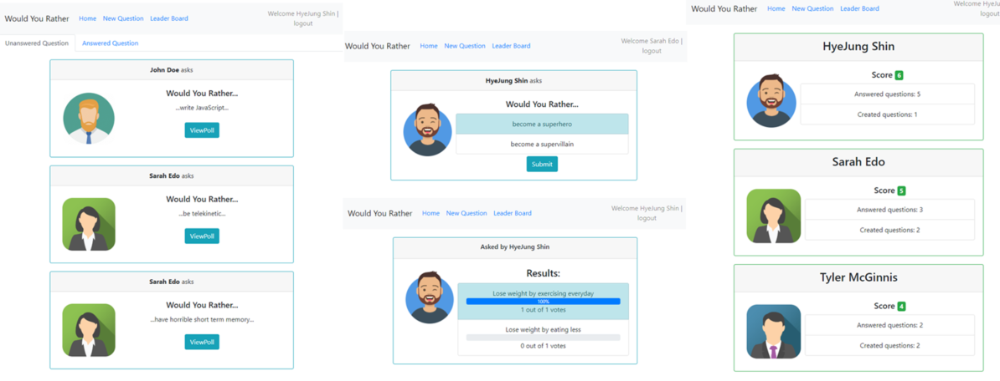

# Would You Rather Project

This is the final project for Udacity React Nanodegree React & Redux course.

## Overview

In the "Would You Rather?" Project, you'll build a web app that lets a user play the “Would You Rather?” game. The game goes like this: A user is asked a question in the form: “Would you rather [option A] or [option B] ?”. Answering "neither" or "both" is against the rules.

In your app, users will be able to answer questions, see which questions they haven’t answered, see how other people have voted, post questions, and see the ranking of users on the leaderboard.

## Instruction

To get started developing right away:

* install all project dependencies with `npm install`
* start the development server with `npm start`

## Coding Stage🔨
Step 1 - Design the shape of the state and create reducers.

Step 2 - Create a Redux store. Connect logger middleware (optional) and Redux Thunk middleware (alternatively, you can use Redux Saga, etc.).

Step 3 - For each view that needs access to the store, create the component and connect it to the store.

Step 4 - For the component you created in the last step, create actions and action creators. Check that everything works correctly.

Step 5 - Repeat Step 3 & Step 4 for each component that needs access to the store.

Step 6 - Create presentational components and confirm that everything works correctly.

Step 7 - Add React Router.

## Data file 

The `_DATA.js` file represents a fake database and methods that let you access the data. The only thing you need to edit in the ` _DATA.js` file is the value of `avatarURL`. Each user should have an avatar, so you’ll need to add the path to each user’s avatar.

There are two types of objects stored in our database:

* Users
* Questions

### Users

Users include:

| Attribute    | Type             | Description           |
|-----------------|------------------|-------------------         |
| id                 | String           | The user’s unique identifier |
| name          | String           | The user’s first name  and last name     |
| avatarURL  | String           | The path to the image file |
| questions | Array | A list of ids of the polling questions this user created|
| answers      | Object         |  The object's keys are the ids of each question this user answered. The value of each key is the answer the user selected. It can be either `'optionOne'` or `'optionTwo'` since each question has two options.

### Questions

Questions include:

| Attribute | Type | Description |
|-----------------|------------------|-------------------|
| id                  | String | The question’s unique identifier |
| author        | String | The author’s unique identifier |
| timestamp | String | The time when the question was created|
| optionOne | Object | The first voting option|
| optionTwo | Object | The second voting option|

### Voting Options

Voting options are attached to questions. They include:

| Attribute | Type | Description |
|-----------------|------------------|-------------------|
| votes             | Array | A list that contains the id of each user who voted for that option|
| text                | String | The text of the option |

Your code will talk to the database via 4 methods:

* `_getUsers()`
* `_getQuestions()`
* `_saveQuestion(question)`
* `_saveQuestionAnswer(object)`

1) `_getUsers()` Method

*Description*: Get all of the existing users from the database.  
*Return Value*: Object where the key is the user’s id and the value is the user object.

2) `_getQuestions()` Method

*Description*: Get all of the existing questions from the database.  
*Return Value*: Object where the key is the question’s id and the value is the question object.

3) `_saveQuestion(question)` Method

*Description*: Save the polling question in the database.  
*Parameters*:  Object that includes the following properties: `author`, `optionOneText`, and `optionTwoText`. More details about these properties:

| Attribute | Type | Description |
|-----------------|------------------|-------------------|
| author | String | The id of the user who posted the question|
| optionOneText| String | The text of the first option |
| optionTwoText | String | The text of the second option |

*Return Value*:  An object that has the following properties: `id`, `author`, `optionOne`, `optionTwo`, `timestamp`. More details about these properties:

| Attribute | Type | Description |
|-----------------|------------------|-------------------|
| id | String | The id of the question that was posted|
| author | String | The id of the user who posted the question|
| optionOne | Object | The object has a text property and a votes property, which stores an array of the ids of the users who voted for that option|
| optionTwo | Object | The object has a text property and a votes property, which stores an array of the ids of the users who voted for that option|
|timestamp|String | The time when the question was created|

4) `_saveQuestionAnswer(object)` Method

*Description*: Save the answer to a particular polling question in the database.
*Parameters*: Object that contains the following properties: `authedUser`, `qid`, and `answer`. More details about these properties:

| Attribute | Type | Description |
|-----------------|------------------|-------------------|
| authedUser | String | The id of the user who answered the question|
| qid | String | The id of the question that was answered|
| answer | String | The option the user selected. The value should be either `"optionOne"` or `"optionTwo"`|
